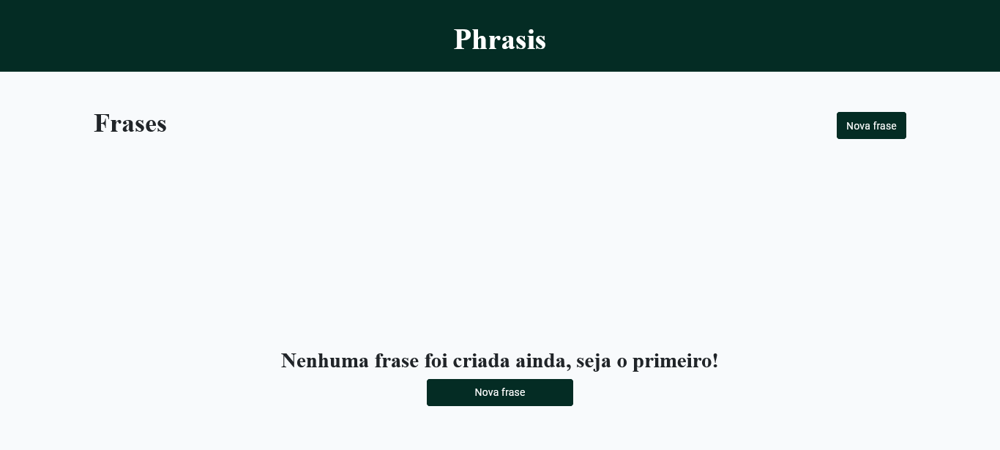
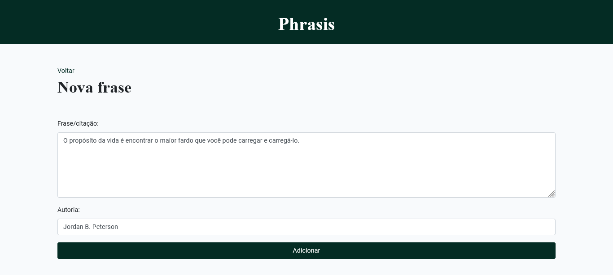
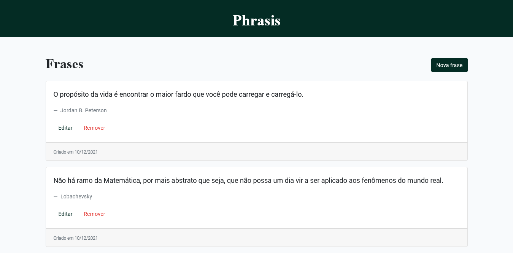
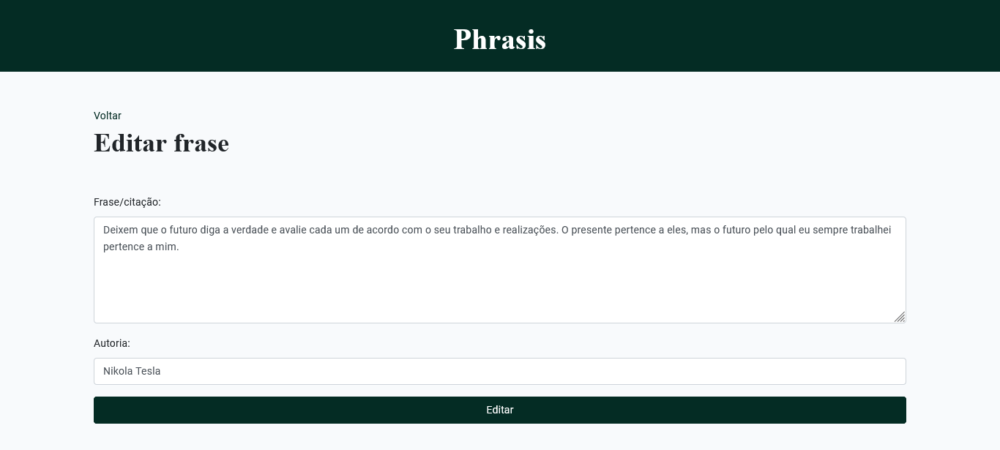
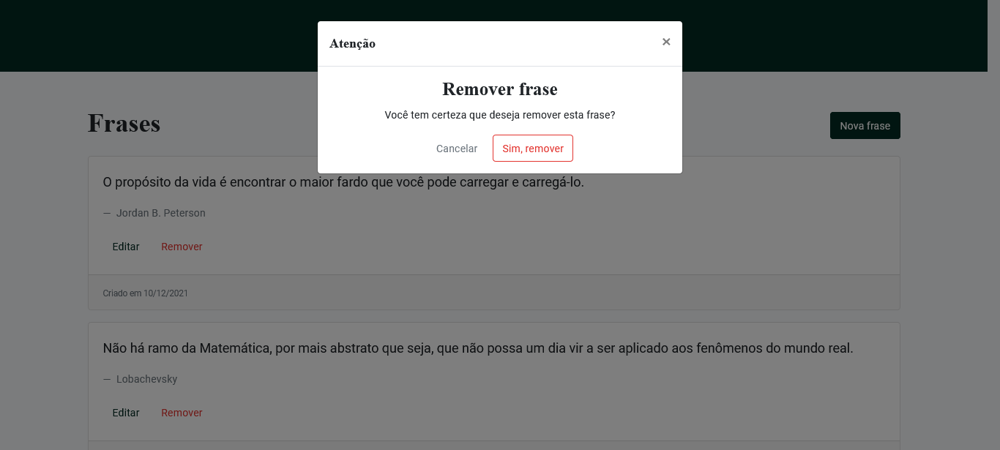

# Phrasis
## Sua coleção online de frases e citações

**Phrasis** é um espaço online para usuários registrarem frases e citações.

O funcionamento é bem simples e não necessita de conta, basta adicionar a frase e seu autor e salvar!

Na tela inicial o usuário vê todas as frases salvas e tem a opção de editar ou excluir uma frase ou citação.

---
### Sobre o sistema

O sistema foi desenvolvido utilizando o *framework* **[Laravel](https://laravel.com 'Saiba mais')** com a linguagem **PHP**.

Para estilizar a interface e criar *components* utilizou-se o **[Vue Js](https://vuejs.org/ 'Saiba mais')**.

Os dados são persistidos no banco de dados usando o SGBD MySQL.

#### Interface

Tela inicial (sem frases cadastradas):

Página de inserção de nova frase:

Listagem de frases salvas:

Página de edição de frase:

Aviso de exclusão de uma frase:

---
### Instruções de *Deploy*

#### Pré-requisitos:
* Possuir o [Composer](https://getcomposer.org/ 'Saiba mais') instalado;
* Ter o [PHP](http://php.net/manual/en/install.php 'Saiba mais') instalado;
* Possuir o [MySQL](https://dev.mysql.com/doc/mysql-installation-excerpt/5.7/en/ 'Saiba mais') instalado;
* Ter o *schema* [phrasis_db](https://github.com/fabioTowers/phrasis/blob/main/phrasis_db.sql 'Script de criação');
* Criar um arquivo .env na pasta da aplicação, seguindo o exemplo de preenchimento do [arquivo de exemplo](https://github.com/fabioTowers/phrasis/blob/main/.env.example).

#### Executar a aplicação:
1. Navegar até o diretório do projeto via prompt de comando;
2. Digitar e executar o comando `composer install --no-scripts` (apenas na primeira execução, para baixar as dependências do projeto);
3. Digitar e executar o comando `php artisan migrate` (apenas na primeira execução, cria as tabelas usadas na aplicação);
4. Digitar e executar o comando `php artisan serve`;
5. Acessar pelo navegador o endereço `http://127.0.0.1:8000`.

---
### Desenvolvedores

Projeto desenvolvido para a disciplina de **Programação Dinâmica para Web (PDWEL)**.

Criado por:

> *[Carolina de Moraes (SP3030571)](https://github.com/CarolinaMoraes 'Ver perfil no GitHub')*

> *[Fabio Mendes (SP3023184)](https://github.com/fabioTowers 'Ver perfil no GitHub')*
